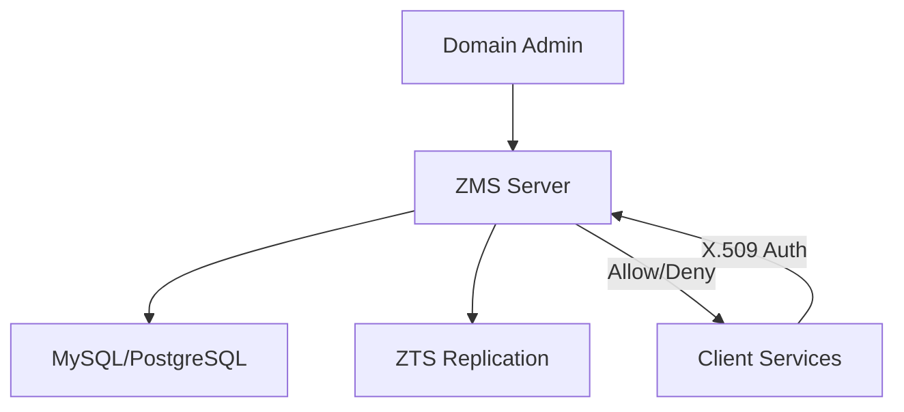
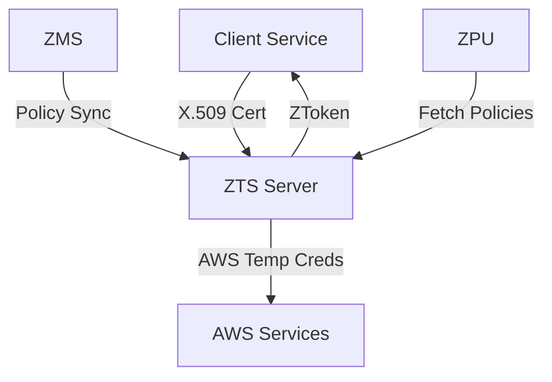
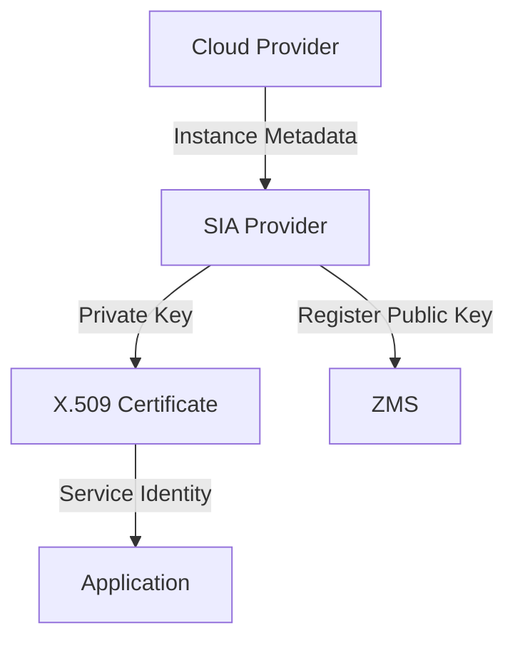
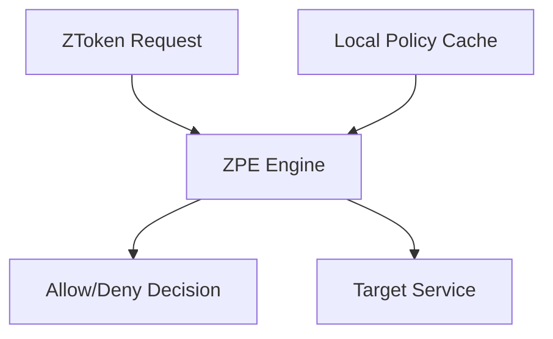
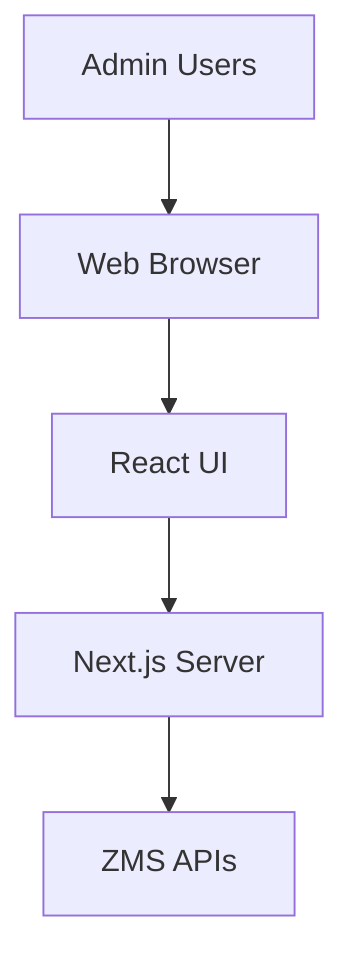
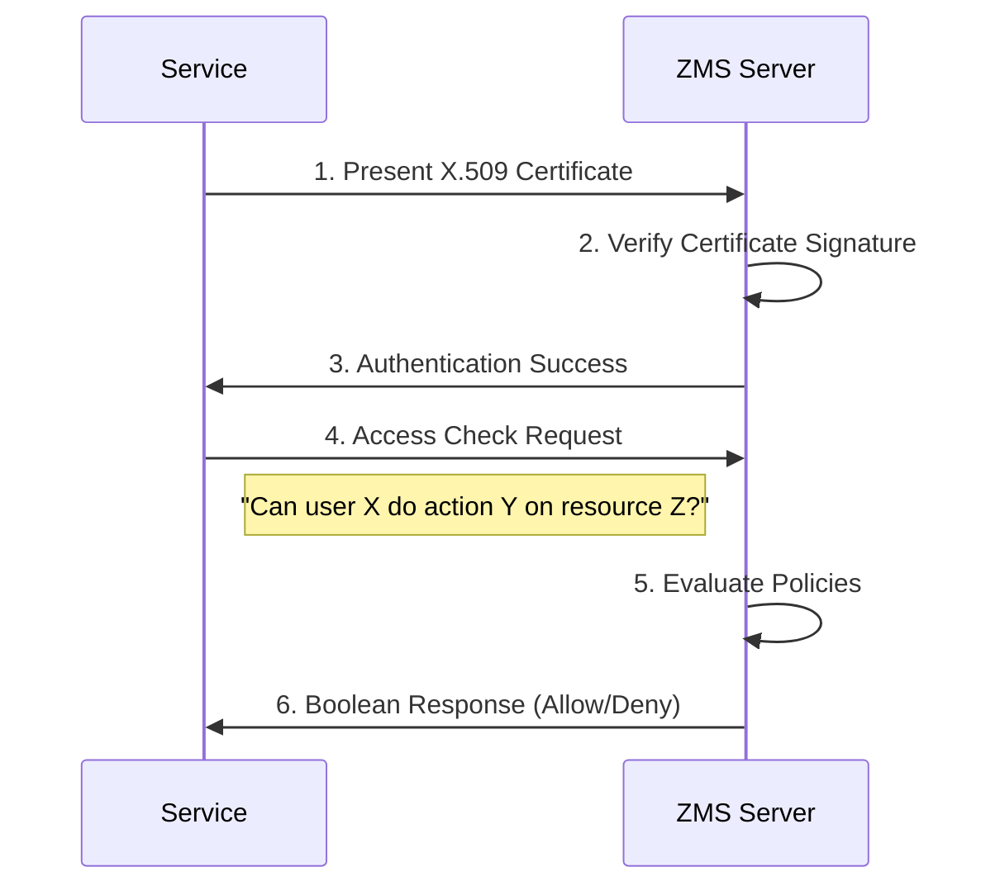
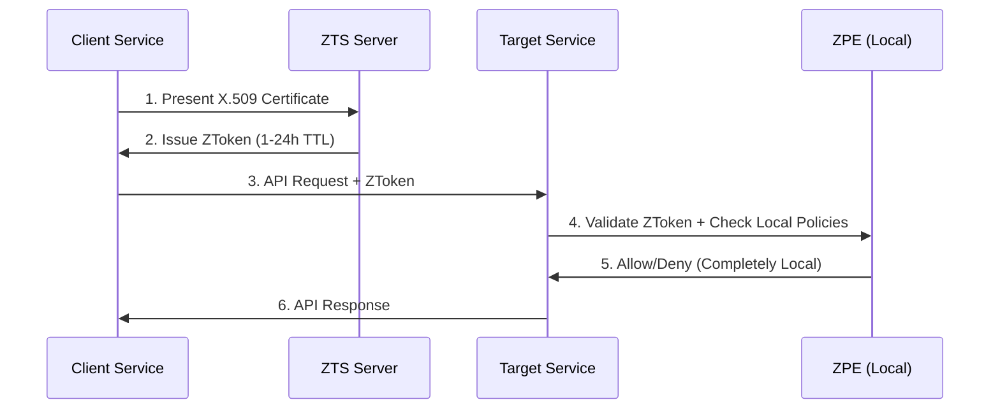

# Tổng Quan Dự Án AthenZ

**AthenZ** là một nền tảng mã nguồn mở enterprise-grade cung cấp **xác thực dịch vụ** dựa trên chứng chỉ X.509 và **kiểm soát truy cập chi tiết** (fine-grained access control) cho các hạ tầng động. Hãy tưởng tượng AthenZ như một **hệ thống an ninh thông minh** cho toàn bộ data center - giống như một tòa nhà văn phòng hiện đại với hệ thống thẻ từ tiên tiến, nơi mỗi nhân viên có thẻ riêng quyết định họ có thể vào phòng nào và làm gì trong đó.

## Mục Đích Chính

AthenZ giải quyết ba vấn đề bảo mật cốt lõi trong môi trường cloud hiện đại:

- **Service Authentication**: "Bạn là ai?" - Xác thực danh tính dịch vụ qua X.509 certificates
- **Role-Based Access Control (RBAC)**: "Bạn có quyền làm gì?" - Kiểm soát truy cập chi tiết dựa trên vai trò
- **AWS Temporary Credentials**: Truy cập AWS services một cách an toàn từ on-premise

## Thành Phần Kiến Trúc

### 1. ZMS (Authorization Management System)
**Ẩn dụ**: Như "văn phòng nhân sự trung tâm" của một tập đoàn lớn

**Mô tả**: ZMS là nguồn gốc tin cậy (source of truth) cho tất cả domains, roles, và policies trong hệ thống. Đây là nơi quản lý tập trung mọi quy tắc phân quyền.

**Trách nhiệm**:
- Quản lý domains, roles, và policies cho toàn hệ thống
- Cung cấp REST APIs để CRUD các entities cơ bản
- Xác thực services thông qua X.509 certificates
- Hỗ trợ centralized authorization checks
- Nhân bản dữ liệu đến ZTS servers

**Công nghệ**:
- **Backend**: Java 11 với Maven build system
- **Framework**: Jersey (JAX-RS) cho REST APIs
- **Database**: MySQL 8.0+ hoặc PostgreSQL 12+
- **Container**: Jetty 12 server



### 2. ZTS (Authorization Token System)
**Ẩn dụ**: Như "máy phát vé tự động" tại các ga tàu điện ngầm

**Mô tả**: ZTS là dịch vụ phát hành token xác thực, hoạt động như bản sao local của ZMS data để kiểm tra membership trong roles và phát hành ZTokens cho decentralized authorization.

**Trách nhiệm**:
- Phát hành ZTokens có thời hạn ngắn (1-24 giờ)
- Nhận và cache policies từ ZMS
- Hỗ trợ horizontal scaling với multiple instances
- Cung cấp AWS temporary credentials
- Serve signed policy files cho ZPE

**Đặc điểm**:
- Token-based authentication cho high-performance scenarios
- Hoạt động độc lập sau khi đồng bộ với ZMS
- Load balancing và high availability support



### 3. SIA (Service Identity Agent) Provider
**Ẩn dụ**: Như "nhân viên an ninh" tự động làm thẻ nhân viên mới

**Mô tả**: SIA Provider chạy như daemon trên mỗi host/container, tự động tạo và refresh X.509 certificates cho services để establish identity với Athenz system.

**Trách nhiệm**:
- Tự động tạo và refresh X.509 certificates (30 ngày TTL, daily refresh)
- Bootstrap service identity từ cloud metadata
- Tích hợp với multiple cloud providers
- Secure key management và storage

**Platform Support**:
- **AWS**: EC2, ECS, Fargate, Lambda, EKS
- **GCP**: GCE, GKE, Cloud Run
- **Azure**: Virtual Machines
- **CI/CD**: GitHub Actions, Buildkite, Harness



### 4. ZPE (Authorization Policy Engine)
**Ẩn dữ**: Như "bộ quy tắc thông minh offline" trong smartphone

**Mô tả**: ZPE là thư viện evaluation engine cho decentralized authorization, chỉ sử dụng local cache để đưa ra quyết định Allow/Deny mà không cần network calls.

**Trách nhiệm**:
- Evaluate policies locally với ZTokens
- Cache policies theo domain để giảm footprint
- Hỗ trợ wildcard matching và complex logic
- Xử lý "Allow" default với "Deny" override semantics

**Logic Processing**:
- Tất cả assertions được treat như "big OR"
- Default effect: "Allow"
- Bất kỳ "Deny" nào sẽ override tất cả "Allow"
- Prefix-matching wildcards support



### 5. ZPU (Authorization Policy Engine Updater)
**Ẩn dữ**: Như "dịch vụ cập nhật phần mềm tự động"

**Mô tả**: ZPU là utility tự động retrieve policy files từ ZTS cho provisioned domains trên host, cung cấp fresh policies cho ZPE evaluation.

**Trách nhiệm**:
- Fetch signed policies từ ZTS theo schedule (thường daily)
- Update local policy cache cho ZPE
- Verify policy integrity qua digital signatures
- Atomic policy updates per domain

### 6. Web UI (React Frontend)
**Ẩn dữ**: Như "dashboard điều khiển" của hệ thống

**Mô tả**: Modern web interface để quản lý domains, roles, policies và monitor system activities.

**Tech Stack**:
- **Frontend**: React 18 với Next.js framework
- **State Management**: Redux Toolkit
- **Styling**: Emotion CSS-in-JS + Denali Design System
- **Authentication**: Passport.js với multiple strategies
- **Security**: CSRF protection, Helmet.js, cookie sessions



## Luồng Xác Thực và Phân Quyền

### Centralized Authorization (Control-Plane)

**Mô tả**: Traditional flow phù hợp cho provisioning và configuration use cases với low request volume.



**Ưu điểm**: 
- Simple implementation
- No local dependencies
- Real-time policy updates

**Nhược điểm**:
- Network latency cho mỗi request
- Central bottleneck
- Không suitable cho data-plane operations

### Decentralized Authorization (Data-Plane)

**Mô tả**: High-performance flow với local policy evaluation, suitable cho production workloads với high throughput.



**Ưu điểm**:
- Zero network latency cho authorization
- Horizontal scalability
- High availability (no external dependencies)

**Nhược điểm**:
- Complex setup với policy synchronization
- Potential policy staleness (until next sync)

## Cấu Trúc Codebase

### Thư Mục Chính

```
athenz/
├── servers/              # Server implementations
│   ├── zms/             # ZMS server code
│   └── zts/             # ZTS server code
├── core/                # Core data models & business logic
│   ├── zms/             # ZMS core models (Domain, Role, Policy)
│   ├── zts/             # ZTS core models (Token, Certificate)
│   └── msd/             # Metrics Service Daemon
├── libs/                # Shared libraries
│   ├── java/            # Java libs (auth_core, server_common, etc.)
│   ├── go/              # Go libs (SIA, zmscli, athenzutils)
│   └── nodejs/          # Node.js libs (auth_core, clients)
├── clients/             # Client SDKs
│   ├── java/            # Java clients (ZMS, ZTS, ZPE)
│   ├── go/              # Go clients
│   └── nodejs/          # Node.js clients
├── ui/                  # React-based Web UI
├── utils/               # CLI utilities (zms-cli, zts-roletoken, etc.)
├── provider/            # SIA implementations per platform
│   ├── aws/             # AWS (EC2, EKS, Fargate)
│   ├── gcp/             # GCP (GCE, GKE, Cloud Run)
│   ├── azure/           # Azure VMs
│   └── github/          # GitHub Actions
├── containers/          # Container configurations
├── docker/              # Docker development environment
└── kubernetes/          # K8s deployment manifests
```

### Technology Stack Summary

| Component | Language | Framework | Database | Container |
|-----------|----------|-----------|----------|-----------|
| ZMS Server | Java 11 | Jersey + Jetty | MySQL/PostgreSQL | Docker |
| ZTS Server | Java 11 | Jersey + Jetty | MySQL/PostgreSQL | Docker |
| Web UI | JavaScript | React + Next.js | - | Docker |
| SIA Providers | Go 1.19+ | Native Go | - | Binary |
| Client Libraries | Multi | Platform-specific | - | Library |
| Build System | Maven | XML Configuration | - | - |

## Lời Khuyên Onboarding

### Yêu Cầu Hệ Thống

**Development Environment**:
- Java 11+ (OpenJDK recommended)
- Maven 3.8+
- Docker & Docker Compose
- Go 1.19+ (cho SIA providers)
- Node.js 16+ (cho Web UI development)
- MySQL 8.0+ hoặc PostgreSQL 12+

### Quick Start Guide

```bash
# 1. Clone repository
git clone https://github.com/AthenZ/athenz.git
cd athenz

# 2. Build entire project
mvn clean install -DskipTests

# 3. Start local development environment
./start-local-athenz.sh

# 4. Access Web UI (sau khi setup xong)
# URL: https://localhost:9443/athenz
# Setup admin user theo docs/dev_environment.md
```

### Learning Roadmap

#### **Tuần 1: Foundation**
1. Đọc `README.md` và `docs/system_view.md`
2. Setup local development environment theo `docs/dev_environment.md`
3. Khám phá Web UI và tạo domain đầu tiên
4. Hiểu basic concepts: Domain, Role, Policy, Service Identity

#### **Tuần 2: Deep Dive**
1. Nghiên cứu X.509 certificates và mutual TLS authentication
2. Thực hành với ZMS REST APIs
3. Hiểu ZToken flow và decentralized authorization
4. Test policy evaluation với ZPE locally

#### **Tuần 3: Hands-on Development**
1. Tạo simple client application integrate với Athenz
2. Customize authentication provider cho use case riêng
3. Deploy local Athenz instance với Docker
4. Monitor và troubleshoot common issues

#### **Tuần 4: Production Ready**
1. Cloud provider integrations (AWS/GCP/Azure)
2. Multi-tenancy và cross-domain trust scenarios
3. Performance tuning và scaling strategies
4. Security hardening và best practices

### Lỗi Thường Gặp

| Vấn đề | Nguyên nhân | Giải pháp |
|--------|-------------|-----------|
| Certificate validation errors | Clock synchronization, invalid CA | Sync system clocks, regenerate certificates |
| Database connection failures | Wrong credentials/connection string | Check database config in properties files |
| UI không load được | Node.js version mismatch, missing dependencies | Use Node.js 16+, run `npm install` |
| Maven build failures | Java version issues, missing dependencies | Use Java 11, check Maven settings |
| Token validation failures | Clock skew, expired tokens | Synchronize clocks, check token TTL settings |
| SIA certificate bootstrap fails | Cloud metadata not available, wrong IAM permissions | Check instance metadata service, verify IAM roles |

### Tài Liệu Tham Khảo

**Setup Guides**:
- [Development Environment](docs/dev_environment.md)
- [ZMS Server Setup](docs/setup_zms.md)
- [ZTS Server Setup](docs/setup_zts.md)
- [UI Server Setup](docs/setup_ui.md)

**Architecture Documentation**:
- [System View](docs/system_view.md)
- [Authorization Flow](docs/auth_flow.md)
- [Data Model](docs/data_model.md)
- [Service Authentication](docs/service_authentication.md)

**Developer Examples**:
- [Java Centralized Access Example](docs/example_java_centralized_access.md)
- [Java Decentralized Access Example](docs/example_java_decentralized_access.md)
- [Go Client/Server Example](docs/example_go_centralized_access.md)

### Community & Support

- **Developer Discussions**: [Athenz-Dev Google Group](https://groups.google.com/d/forum/athenz-dev)
- **User Questions**: [Athenz-Users Google Group](https://groups.google.com/d/forum/athenz-users)
- **Bug Reports**: [GitHub Issues](https://github.com/AthenZ/athenz/issues)
- **Project Analytics**: [SourceSpy Dashboard](https://sourcespy.com/github/yahooathenz/)

### Bước Tiếp Theo

1. **Immediate**: Setup development environment và explore codebase structure
2. **Short-term**: Tạo test domain và practice với basic RBAC operations
3. **Medium-term**: Implement simple service integration với Athenz authentication
4. **Long-term**: Contribute back to open source community hoặc deploy production instance

---

**AthenZ** là một enterprise-grade security platform được thiết kế cho modern cloud-native architectures. Với comprehensive documentation và active community, đây là foundation mạnh mẽ cho việc implement zero-trust security model trong organization của bạn.
